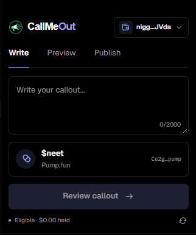
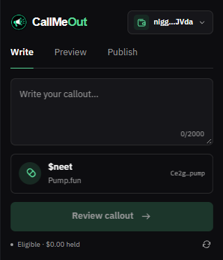
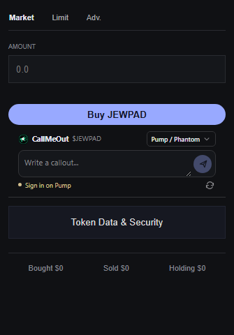

# CallMeOut

Write Pump callouts directly in the trading panel on Axiom, GMGN, and Padre Solana token pages. The compact composer follows each site's active theme.

| Axiom | GMGN | Padre |
| --- | --- | --- |
|  |  |  |

## Install

1. Open `chrome://extensions` or `edge://extensions` and enable Developer mode.
2. Select **Load unpacked** and choose this repository folder, which contains `manifest.json`.
3. Refresh a supported Solana token page.

The toolbar icon focuses the composer on a token page and opens the Wallets page elsewhere.

## Wallets

- **Pump / Phantom** uses your Pump login in the same browser profile.
- To add a wallet, open **CallMeOut → Wallets** and paste a Solana base58 private key, 32-byte seed, or 64-number JSON array. The address is derived automatically.
- Switch wallets with the selector above the composer. Imported wallets sign the Pump login message automatically.
- Imported seeds are encrypted in local browser profile storage. Anyone with access to your unlocked browser profile may still be able to use them.

The private key is entered only on the extension's Wallets page. It is not sent to Pump or the trading sites.

## Posting

The composer identifies the token, checks Pump eligibility for the selected wallet, and saves a draft per token. Review your text and press **Publish on Pump** to submit it. Nothing is published automatically.

This is an independent extension. Pump's private frontend endpoints and the supported trading sites' layouts may change. See the [privacy policy](PRIVACY.md).
