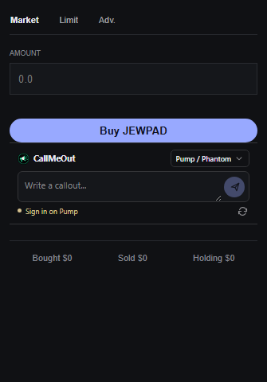

# CallMeOut

Write Pump callouts directly in the trading panel on Axiom, GMGN, and Padre Solana token pages. The compact composer follows each site's active theme.



## Browser extension

1. Open `chrome://extensions` or `edge://extensions` and turn on Developer mode.
2. Select **Load unpacked** and choose the `extension` folder.
3. Refresh a supported Solana token page.

The composer reads the token mint from the page, checks Pump eligibility, and keeps a draft per token. Review your text and press **Publish on Pump** to submit it. Nothing is published automatically.

Use your current Pump / Phantom browser session, or add a Solana private key in **CallMeOut → Wallets**. Imported wallets sign the Pump login message automatically. See [extension setup and wallet details](extension/README.md).

## Python client

The separate, unofficial [Python client](pump_callout.py) uses the captured Pump API flow and only the standard library. To sign in with Phantom:

```sh
python phantom_login.py --mint TOKEN_MINT
```

To publish from code after signing the exact `Sign in to pump.fun: <timestamp_ms>` message:

```python
from pump_callout import CalloutDraft, PumpCalloutClient

client = PumpCalloutClient()
client.login_session("WALLET_ADDRESS", "BASE58_SIGNATURE", SIGNED_TIMESTAMP_MS)
draft = CalloutDraft(mint="TOKEN_MINT", thesis="Your specific, verifiable thesis and position disclosure")
result = client.publish(draft, confirm=True)
```

Pump's eligibility response determines whether a wallet can post; the client does not assume a fixed USD threshold. These are private frontend endpoints and may change. [Pump's callout terms](https://pump.fun/docs/callout-reward-terms) apply.
